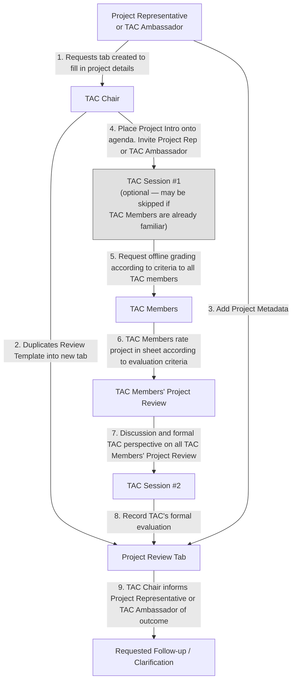

- RFC Title: Eclipse SDV Project Purview Rating Criteria and Process
- Submission Date: 2026-09-25
- RFC PR: https://github.com/PLeVasseur/sdvwg-tac-rfcs/pull/2
- Follow-on Actions: (to be filled in after the TAC review)

# Summary
[summary]: #summary

This RFC formalizes the rating criteria and review process the Eclipse SDV WG TAC uses to recommend whether a project should be brought under, or continued under, the Working Group's purview. It captures the review as a state flow and the scoring dimensions as a rating table, both already discussed and agreed by the TAC, so that future purview recommendations are made consistently, are explainable to project proposers, and can themselves evolve through the same RFC process as any other TAC decision.

# Motivation
[motivation]: #motivation

The TAC is responsible for recommending to the Steering Committee which projects should be brought under, or removed from, the Working Group's purview. Historically these recommendations were made case by case through committee discussion and a vote, without a shared, written set of criteria. TAC members have repeatedly asked for something more objective than "gut feeling" — both to give proposers a clear idea of what is being evaluated, and to give a concrete rationale to a project when it is not recommended.

Early discussion proposed rating dimensions such as adoption, engineering quality, and ecosystem integration. A scoring template was then drafted and applied retroactively to existing projects to validate it against real cases before being adopted as a working baseline. This RFC formalizes the resulting [rating criteria and process][criteria-sheet], along with its supporting [worked examples and history][examples-sheet], into the TAC's RFC record.

# Stakeholder impact
[stakeholder-impact]: #stakeholder-impact

If adopted, this rating criteria and process becomes the TAC's standard input for purview recommendations.

## TAC members

TAC members run every purview recommendation through the same review process and rating table instead of an ad hoc discussion, ending in one of four concrete outcomes — Recommend, Recommend with clarification, Invite to TAC, or Defer. When a project is not recommended, the score card gives a concrete rationale to point to instead of an unstructured "no."

## Projects seeking inclusion under the Working Group's purview

These projects can see in advance what will be evaluated and prepare accordingly, rather than learning the criteria only through the review itself.

## The Steering Committee

The Steering Committee receives purview recommendations backed by a consistent rationale and score card rather than a free-form vote summary.

## Existing Eclipse SDV projects

Existing projects are unaffected unless the TAC is specifically asked to re-evaluate them; this RFC does not, by itself, subject already-included projects to re-review.

# Detailed proposal
[detailed-proposal]: #detailed-proposal

## Review process

The review process below shows how a project moves from an initial request to a recorded TAC disposition.

Below is again the same flow restated as steps:

1. The Project Representative or TAC Ambassador requests that a tab be created to fill in project details.
2. The TAC Chair duplicates the Review Template into a new tab.
3. The Project Representative or TAC Ambassador adds the Project Metadata.
4. The TAC Chair places the project intro onto the agenda and invites the Project Representative or TAC Ambassador to **TAC Session #1** (optional — may be skipped if TAC members are already familiar with the project).
5. TAC Session #1 requests that all TAC members grade the project offline, according to the criteria.
6. TAC Members rate the project in the sheet according to the evaluation criteria.
7. TAC Members' individual project reviews are discussed at **TAC Session #2**, forming a formal TAC perspective.
8. TAC Session #2 records the TAC's formal evaluation back into the Project Review Tab.
9. The TAC Chair informs the Project Representative or TAC Ambassador of the outcome, which may include a requested follow-up or clarification.

## Project intake and metadata

Each project under review gets its own tab (duplicated from the Review Template, see [Review process](#review-process)) with the following identifying fields:

| Field | Description |
| --- | --- |
| Project Name | Enter Eclipse project name |
| Project URL | Link to projects.eclipse.org page |
| Primary SDV Role | Person or group preparing the rating |
| Total Score | Date of TAC review |
| Recommendation Class | Choose one: SDV.Edge / SDV.Ops / SDV.Dev / Integration / Supporting Technology |
| Requested Follow-up / Clarification | Choose one: Recommend / Recommend with clarification / Invite to TAC / Defer |

## Eligibility criteria

Before scoring, the following gating checks are recorded. They carry no points themselves, but establish whether there is enough to evaluate at all:

| Criterion | Guidance |
| --- | --- |
| Inspectable artifacts available | Yes / Not yet / N.A. No points. Code, docs, API, architecture, or demo exists. |
| Clear SDV problem statement | Yes / Not yet / N.A. No points. Project explains what SDV problem it solves. |
| Relationship to existing SDV projects | Yes / Not yet / N.A. No points. Project explains complementarity or integration potential. |
| Maintainer / contact identified | Yes / Not yet / N.A. No points. Project can provide a contact for TAC follow-up. |

## Rating criteria and scoring (Review Card)

Each TAC member scores the project 0–3 on each of the following criteria, along with an evidence level for that score:

| Criterion | Score (0–3) | Evidence Level (A–D) | Comment |
| --- | --- | --- | --- |
| P1. SDV problem relevance | 0 = no visible SDV relevance; 1 = indirect relevance; 2 = clear SDV-adjacent relevance; 3 = directly solves a known SDV problem | A - Demonstrated B - Documented C - Claimed D - Unknown | |
| P2. SDV.Edge contribution | 0 = no Edge contribution; 1 = indirect Edge relevance; 2 = meaningful Edge support; 3 = primary contribution to in-vehicle stack, service fabric, communication, runtime, middleware, orchestration, diagnostics, or similar | A - Demonstrated B - Documented C - Claimed D - Unknown | |
| P3. SDV.Ops contribution | 0 = no Ops contribution; 1 = indirect Ops relevance; 2 = meaningful Ops support; 3 = primary contribution to in-cloud mobility solutions, fleet management, deployment, observability, lifecycle, or mobility software stack operations | A - Demonstrated B - Documented C - Claimed D - Unknown | |
| P4. SDV.Dev contribution | 0 = no Dev contribution; 1 = indirect developer support; 2 = meaningful developer enablement; 3 = primary contribution to toolchains, workflows, SDKs, APIs, testing, simulation, CI/CD, or in-/off-vehicle application development | A - Demonstrated B - Documented C - Claimed D - Unknown | |
| P5. SDV WG engineering fit | 0 = no visible open engineering fit; 1 = public repo/basic docs; 2 = CI/releases/contribution flow/reviewable artifacts; 3 = code-first, X-as-code, Git/diff-friendly artifacts, agile process, AI-readiness, SOTA ambition, maturity metadata/badges where applicable | A - Demonstrated B - Documented C - Claimed D - Unknown | |
| P6. Automotive demonstrability | 0 = no automotive/SDV example; 1 = automotive relevance described; 2 = automotive example/demo/reference integration exists; 3 = executable automotive reference, Eclipse SDV Blueprint, maintained cross-project integration, or comparable demonstrator | A - Demonstrated B - Documented C - Claimed D - Unknown | |

### Evidence levels

| Evidence Level | Explanation |
| --- | --- |
| A - Demonstrated | Working code, release, CI, docs, executable demo, reference integration, SDV Blueprint, or maintained project artifact exists |
| B - Documented | Architecture, roadmap, design, API, or specification explains the contribution, but implementation is partial or not fully reviewed |
| C - Claimed | Mentioned in project description, presentation, or proposal, but not yet backed by reviewed artifacts |
| D - Unknown | TAC lacks enough evidence |

### Score interpretation

The 6 criteria above sum to a **Total Score** out of 18, which maps to a recommended fit:

| Total Score | Interpretation |
| --- | --- |
| 14–18 | Strong fit for SDV WG purview |
| 10–13 | Good fit |
| 7–9 | Possible fit |
| 0–6 | Not enough positive evidence yet |

## Worked examples and history

The [worked examples and history][examples-sheet] sheet applies this rating table to real projects the TAC has already reviewed, and is kept as supporting evidence for how the criteria behave in practice rather than reproduced in full here.

# Drawbacks
[drawbacks]: #drawbacks

A fixed rating table can feel mechanical for a genuinely novel project that does not fit its existing dimensions well, and the dimensions themselves will likely need to be revisited as the ecosystem changes.

Written criteria can also be misread as a checklist that mechanically produces a decision. The rating table is an input to the TAC's discussion and vote, not a substitute for it; the review process in this RFC keeps the TAC's disposition as the actual decision point.

# Rationale and alternatives
[rationale-and-alternatives]: #rationale-and-alternatives

## Why this proposal

The TAC arrived at this proposal through iterative discussion and validated it against real projects before adopting it as a working baseline, so formalizing it as-is avoids re-opening fundamentals the TAC has already agreed on.

## Alternative: continue case-by-case discussion without written criteria

This was the status quo, and the one TAC members explicitly asked to move past.

## Alternative: wait for a more complete or automated scoring tool before formalizing anything

The TAC agreed the current proposal is good enough to start with, and the RFC process itself allows the criteria to be revised through a follow-on RFC as gaps are found.

## Impact of not doing this

Purview recommendations continue to happen without a durable, publicly reviewable record of the criteria behind them, and each new proposal risks re-opening fundamentals the TAC has already settled.

# Prior art
[prior-art]: #prior-art

The Eclipse Foundation's project lifecycle also uses a review to assess projects against defined criteria. That provides a useful reference for the rating criteria proposed here.

# Unresolved questions
[unresolved-questions]: #unresolved-questions

- Should this same rating table also be used for periodic re-review of projects already under the Working Group's purview, or is this RFC scoped to initial purview recommendations only?
- How often should the worked-examples and history sheet be refreshed as new projects are evaluated?

# Future possibilities
[future-possibilities]: #future-possibilities

If this rating criteria and process proves useful, it could later support additional work without expanding the scope of this RFC.

Possible extensions include:

- extending the same rating approach to periodic re-review of projects already under purview, alongside the TAC's separate discussions on identifying inactive projects.
- partly automating some rating dimensions from Eclipse project metadata rather than scoring them by hand.

[criteria-sheet]: https://docs.google.com/spreadsheets/d/1ayQJvdjo98-8T0dLLF6ePcpta7IJsb8JV4q3ysyHjSg/edit?usp=sharing
[examples-sheet]: https://docs.google.com/spreadsheets/d/1l4S8n5bZydvSWkQwWoFBIgOMpNTQp6p0ofGJpy0J9bs/edit?usp=sharing
